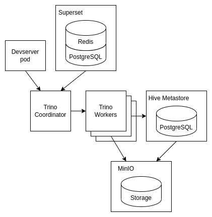
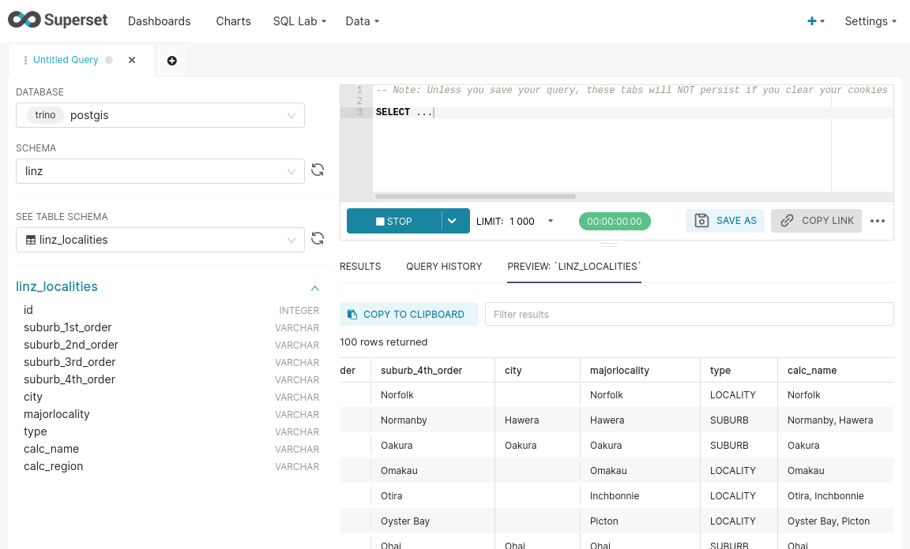

# Walden

Walden is a small data lake meant for solitary use. Read more about it on [our website](https://scie.nz/walden).



## Prerequisites

There are a few things you need before you create your Walden deployment:

- You need a Linux environment from which to run the code. The code was tested against Ubuntu 20.04 LTS as well as Arch Linux.
- You need a Kubernetes Cluster. If you don't know what that is, check out [K3s](https://k3s.io/).
- Your Kubernetes cluster needs to have at least 4 nodes (regular PCs are fine), with at least 6GB of RAM. We run this on 4 machines, each with 16 GB RAM. It works.
- You need to install [Terraform](https://developer.hashicorp.com/terraform/downloads), a tool for deploying things. This is used to manage the deployment of Walden into your cluster.

## Running Walden

### Deploy Walden

```
git clone https://github.com/scie-nz/walden
cd walden/tf

# requires Terraform and kubectl access to cluster:
tf apply
```

You should see a whole bunch of text resulting from the deploy command. As
long as no obvious errors show up, that's expected.

To check the health of your cluster run:
```
kubectl get pods -n walden
```

(If you're using k3s locally, preface this command like so:
 `k3s kubectl get pods -n walden`)

A healthy deployment looks like this:
```
NAME                               READY   STATUS    RESTARTS   AGE
devserver-65d668b5c6-s62m7         1/1     Running   0          49s
metastore-8696bf6b46-455qx         1/1     Running   0          49s
superset-worker-69cd7c966-pwsp8    1/1     Running   0          49s
superset-postgres-0                1/1     Running   0          48s
metastore-postgres-0               1/1     Running   0          48s
superset-66fb584c7d-wc8c4          2/2     Running   0          48s
trino-coordinator-8c6bc455-w2qdw   1/1     Running   0          48s
trino-worker-86d9484f75-7j8cw      1/1     Running   0          47s
superset-redis-0                   1/1     Running   0          47s
minio-0                            1/1     Running   0          47s
minio-1                            1/1     Running   0          36s
minio-2                            1/1     Running   0          27s
minio-3                            1/1     Running   0          21s
```

By default, Walden expects your cluster to have at least four machines/nodes.
If you don't have four nodes, you may see MinIO pods that are stuck in `Pending`.
You can get things unstuck by manually editing the `minio` StatefulSet and removing
the `affinity` block, allowing multiple MinIO pods to deploy on the same machine:
```
# Edit MinIO StatefulSet, remove affinity block
$ kubectl edit statefulset -n walden minio
```

If something else has gone wrong, `kubectl logs -n walden [name of pod]` should help
most of the time. If you need to do more debugging because something is failing
but are new to Kubernetes, about now would be a good time to go through
a [tutorial](https://kubernetes.io/docs/tutorials/kubernetes-basics/).

### Use devserver to access Trino CLI

Assuming the deployment succeeded, you can ssh into the `devserver` pod like so:
```
$ kubectl exec -it -n walden deployment/devserver -- /bin/bash
```

The following steps are performed from within the `devserver` pod.

#### Create a MinIO bucket

Now that you are logged in to the devserver, you are ready to interact with your glorious data pond!

Let's start by creating a bucket in MinIO, the object store service that's included in Walden. We will store data in these buckets:
```
devserver# mc alias set walden-minio/ http://minio:9000 $MINIO_ACCESS_KEY_ID $MINIO_ACCESS_KEY_SECRET
Added `walden-minio` successfully.

devserver# mc mb walden-minio/direct
Bucket created successfully: `walden-minio/direct`
```

Note -- `walden-minio` is an alias to the MinIO deployment created automatically when we start the devserver. We have created a bucket called "direct".

#### Connect Trino to MinIO directly

First, run the following command from the devserver shell. This starts a `trino-cli` session with the `direct` schema against the `hive` data storage provided by Walden.
```
devserver# trino direct
```

We will use this schema to talk directly to the MinIO storage. The `direct` schema does not actually exist in the Hive metastore yet, so we need to create it:
```
trino:direct> CREATE SCHEMA IF NOT EXISTS direct WITH (location='s3a://direct/');
CREATE SCHEMA
```

If you run `SHOW SCHEMAS` you should see:
```
trino:direct> SHOW SCHEMAS;
       Schema
--------------------
 default
 direct
 information_schema
(3 rows)
```

Now we can create a table and store some data:
```
trino:direct> CREATE TABLE IF NOT EXISTS dim_foo(key VARCHAR, val BIGINT);
CREATE TABLE

trino:direct> INSERT INTO dim_foo VALUES ('this', 1), ('is', 2), ('a', 3), ('test', 4);
INSERT: 4 rows
```

Assuming everything is working, you should be able to query the stored values:
```
trino:direct> SELECT key, val FROM dim_foo;
 key  | val
------+-----
 this |   1
 is   |   2
 a    |   3
 test |   4
(4 rows)
```

Now we can press `Ctrl+D` to exit the Trino console session, and look at the files created in the underlying MinIO bucket we created earlier:
```
trino:direct> ^D

devserver# mc ls -r walden-minio/direct
[2022-03-11 06:22:24 UTC]     0B STANDARD dim_foo/
[2022-03-11 06:21:42 UTC]   356B STANDARD 20220311_062141_00005_26e8n_9d96d247-6da3-49f9-a537-b0bc897879b9
```

We can clean up our test data by deleting the table and then the schema:
```
devserver# trino direct

trino:direct> DROP TABLE dim_foo;
DROP TABLE
trino:direct> DROP SCHEMA direct;
DROP SCHEMA
trino:direct> ^D

devserver# mc ls walden-minio/direct
<empty>
```

### Explore data with Superset

Superset provides a convienient UI for exploring the data that you've stored in Trino.
Walden includes an instance of Superset that's preconfigured to connect to Trino.

Superset has been configured with a `walden` user and a randomly generated password.

Get the password for logging into Superset:
```
$ kubectl get secret -n walden superset-admin -o 'jsonpath={.data.pass}' | base64 -d && echo
lONGpASSWoRD64HERE
```

Set up a port-forward to access Superset on port `8088`:
```
$ kubectl port-forward -n walden deployment/superset 8088
```

Go to [http://127.0.0.1:8088/](`http://127.0.0.1:8088/`) and log in with user=`walden` and the password you got earlier.

Two Trino databases should have been automatically added to Superset by Walden:
- `walden-trino` has Trino data, including what we added to a `test` schema in earlier steps. The data itself is being stored to Minio in Hive columnar table format, with the Metastore acting as the index.
- `walden-trino-system` has various Trino System statistics like node connectivity that may also be interesting to explore.
In addition to these autoconfigured, you should be able to add other external databases to Superset as well via `Data` > `Databases` in the top menu.

We can start exploring by going to `SQL Lab` > `SQL Editor` in the top menu.
In the SQL Editor view, select the `walden-trino` database, then the `test` schema that we created earlier.
The values we added to this schema earlier should also be visible via Superset.


### View the Trino Dashboard

Trino also provides a dashboard UI showing basic activity. Set up a port-forward to access the dashboard on port `8080`:
```
$ kubectl port-forward -n walden deployment/trino-coordinator 8080:80
```

Go to [http://127.0.0.1:8080](`http://127.0.0.1:8080`) and log in with any value for the username (it doesn't matter).


## Conclusions

That's it, this is an easy way to get a small data lake working.
This is meant to be a fully functional starting point that can be expanded and customized to fit your needs.
Everything here is provided as-is, so your mileage may vary.
Please report any bugs or issues and we will try to get to them.

## Cloud Provider Installation

Walden can be used either on-premise or in hosted Kubernetes environments.
Here are some example steps for setting up Walden in various cloud providers.

### AWS

This tutorial assumes you already have an AWS account set up. Instructions should be run from either Mac or Linux machines. Also keep in mind this is likely to cost a few dollars in AWS costs to try out. We've been able to keep costs below $5 USD when running a minimal cluster for a short amount of time.

#### Configure AWS EKS Admin

To manage the EKS cluster programmatically from your local machine, you will need to create a new AWS IAM user and grant it appropriate permissions.

The easiest way to do so reproducibly involves using a "CloudShell" session. To bring one up, search for "CloudShell" in your AWS console. Note that you should be logged in with your AWS root account when running these operations.

1. Create IAM user

    Run the following in your AWS cloud shell session
    ```
    aws iam create-user --user-name eksadmin
    ```
    **Note**: you can skip this step if you already have an IAM user you would like to use. Simply replace `eksadmin` with your user name where necessary.

2. Create IAM policies

    To be able to spin up an EKS cluster via `eksctl` we will need to define two new policies, with which we will associate our EKS admin user. The policy definitions are available in policy documents stored in this repositories. To access them, clone the repository first (from your AWS cloud shell session):

    ```
    git clone https://github.com/scie-nz/walden.git
    cd walden
    ```

    We will preserve the account identifier for future use:

    ```
    export AWS_ACCOUNT_ID=$(aws sts get-caller-identity --query "Account" --output text)
    echo $AWS_ACCOUNT_ID
    ```

    We can now render the policies, i.e. by substituting the `AWS_ACCOUNT_ID` we just captured:
    ```
    cat aws/eks-all-access.json | envsubst > eks-all-access-rendered.json
    cat aws/iam-limited-access.json | envsubst > iam-limited-access-rendered.json
    ```

    Then we will create our policies:
    ```
    aws iam create-policy --policy-name EKSAllAccess --policy-document file://eks-all-access-rendered.json
    aws iam create-policy --policy-name IAMLimitedAccess --policy-document file://iam-limited-access-rendered.json
    ```

3. Create IAM EKS Admin group

    First we create our group and add our EKS admin user to it:

    ```
    aws iam create-group --group-name EKSAdmins
    aws iam add-user-to-group --group-name EKSAdmins --user-name eksadmin
    ```

    We are then ready to attach permissions to the group:

    ```
    aws iam attach-group-policy --group-name EKSAdmins --policy-arn arn:aws:iam::$AWS_ACCOUNT_ID:policy/EKSAllAccess
    aws iam attach-group-policy --group-name EKSAdmins --policy-arn arn:aws:iam::$AWS_ACCOUNT_ID:policy/IAMLimitedAccess
    aws iam attach-group-policy --group-name EKSAdmins --policy-arn arn:aws:iam::aws:policy/AmazonEC2FullAccess
    aws iam attach-group-policy --group-name EKSAdmins --policy-arn arn:aws:iam::aws:policy/AWSCloudFormationFullAccess
    ```

    You are now ready to interact with the cluster using your `eksadmin` user. The rest of the interactions will occurr via your regular machine, rather than a cloud shell instance.

#### Deploy EKS cluster

The following set of operations are meant to run on your home machine (Mac or Linux only).

To provision this cluster you will need to have the following software installed:
- the AWS [cli](https://aws.amazon.com/cli/)
- [eksctl](https://docs.aws.amazon.com/eks/latest/userguide/eksctl.html)
- [kubectl](https://kubernetes.io/docs/tasks/tools/)

1. Set up your AWS CLI authentication

    Edit `~/.aws/config` and add your AWS access key ID and secret (your access key ID starts with `AKIA`):

    ```
    [walden]
    aws_access_key_id=[YOUR ACCESS KEY ID GOES HERE]
    aws_secret_access_key=[YOUR ACCESS SECRET GOES HERE]
    ```

    Then run:
    ```
    export AWS_PROFILE=walden
    aws sts get-caller-identity
    ```

    You should see something like:
    ```
    {
        "UserId": "AIDA**********",
        "Account": "1234567890",
        "Arn": "arn:aws:iam::1234567890:user/[someusername]"
    }
    ```

2. Create minimal EKS cluster using `eksctl`

    To create a minimal cluster, run:
    ```
    eksctl create cluster --name=eks-walden --nodes=4 --node-type=r5.large --spot
    ```

    This command will create an EKS cluster, and one default node group with 4 nodes in it. This is purely a test cluster -- `eksctl` being a very powerful tool that allows you to customize your cluster whichever way you see fit.

    The command will take about 30 minutes to run, while AWS provisions requisite resources.

    Once the cluster creation has succeeded, run:
    ```
    kubectl get nodes
    ```

#### Deploy Walden

You now have a working EKS cluster, on which you can deploy Walden just as you would on an on-premise cluster. Follow [these instructions](https://github.com/scie-nz/walden#deploy-walden) to deploy it.

#### Clean up

First, get the name of your nodegroup:
```
eksctl get nodegroup --cluster eks-walden
```

Then, delete the nodegroup:
```
eksctl delete nodegroup [NODEGROUP NAME GOES HERE] --cluster eks-walden
```

You can now delete your cluster:
```
eksctl delete cluster eks-walden
```

Finally, you should clean up your EBS volumes. You can do so by visiting the [Volumes](https://us-west-2.console.aws.amazon.com/ec2/v2/home?#Volumes) section in your AWS console.

NOTE: please take care when cleaning your EBS volumes. You may lose data you care about. Make sure you understand what volumes you're deleting.

### Azure

This tutorial assumes you have a working Azure account, with default quota settings. You will likely need to activate pay-as-you-go billing to be able to provision the AKS cluster described here.

#### Create AKS cluster

First, create a dedicated resource group, this example uses the `centralus` region:
```
az group create --name WaldenResourceGroup -l centralus
```

You are now ready to create your cluster:
```
az aks create -g WaldenResourceGroup -n WaldenAKS --node-count 5 --node-vm-size Standard_B2ms
```

To connect to the cluster:
```
az aks get-credentials --resource-group WaldenResourceGroup --name WaldenAKS
```

#### Deploy Walden

You now have a working AKS cluster, on which you can deploy Walden just as you would on an on-premise cluster. Follow [these instructions](https://github.com/scie-nz/walden#deploy-walden) to deploy it.

#### Clean up

First, delete the cluster:
```
az aks delete --resource-group WaldenResourceGroup --name walden
```

You can now delete the resource group:
```
az group delete --resource-group WaldenResourceGroup
```

## Advanced topics

### Adding external data sources via Trino

External databases can be added to Walden by [connecting them to Trino](https://trino.io/docs/current/connector.html) as a separate "Catalog". The new Trino Catalog can then be [added to Superset](https://superset.apache.org/docs/connecting-to-databases/installing-database-drivers).

This strategy allows using both Trino and Superset to interact with the external data. However, some data types (such as GIS geometry columns) may not work well with Trino. In those cases you can instead connect Superset to the external database directly as described in the next section below.

1. Create a separate Kubernetes `ConfigMap` named `trino-catalog-extra` in the `walden` namespace. This `ConfigMap` should contain one or more `.properties` files for each [Trino connector](https://trino.io/docs/current/connector.html) that you want.
2. If Walden is already deployed, restart the `trino-*` pods manually for the change to take effect.
    ```
    $ kubectl delete pod -n walden trino-coordinator-xxxx-yyyy trino-worker-xxxx-yyyy
    ```
3. Verify that the external data source is accessible by logging in to the `devserver` pod as described above and checking for a data source named `custom`.
    ```
    $ kubectl exec -it -n walden deployment/devserver -- /bin/bash
    # trino-cli --server trino --catalog custom
    trino> SHOW SCHEMAS;
    trino> DESCRIBE <schemaname>.<tablename>;
    ```

Now we should be able to add the new Trino catalog to Superset:

1. Open the Superset UI and log in as described above.
    ```
    $ kubectl get secret -n walden superset-admin -o 'jsonpath={.data.pass}' | base64 -d && echo
    lONGpASSWoRD64HERE
    $ kubectl port-forward -n walden deployment/superset 8088
    ```
2. Go to `Data` > `Databases` via the top menu and click the `+ Database` on the upper right to add a new Database.
3. Select the `Trino` database type from the pull down menu.
4. Set the `SQLAlchemy URI` to `trino://trino/custom`.
5. (OPTIONAL) Switch to the `Advanced` tab and enable the following:
    - SQL Lab:
        - `Expose database in SQL Lab`, followed by...
        - `Allow Multi Schema Metadata Fetch` (optional: don't enable if the DB is very large)
        - `Enable query cost estimation`
        - `Allow this database to be explored`
    - Performance:
        - `Asynchronous query execution`
6. Click `Connect` to create the new Database entry.

The new Database entry can be reconfigured again later if needed.

Now you can switch to `SQL Lab` > `SQL Editor` and preview the new Database, confirming that it looks as expected.

Check the [Trino](https://trino.io/docs/current/connector.html) and [Superset](https://superset.apache.org/docs/connecting-to-databases/installing-database-drivers) docs for any additional information on configuring particular database types.



### Adding external data sources (and other CLI configuration) to Superset

Instead of connecting an external database via Trino, the external database may instead be connected to Superset directly. This means the data will only be accessible via the Superset UI, and will not be accessible via Trino.

Follow the above steps for logging into the Superset UI and adding a new Database entry, except this time you should pick the type of database that you are adding, instead of Trino. The steps are otherwise similar. If your datatype isn't listed, you may need to build a custom `walden-superset` Docker image that installs the required python module(s).

Check the [Superset docs](https://superset.apache.org/docs/connecting-to-databases/installing-database-drivers) for any additional information on configuring particular database types.

If you wish to provide the additional datasources declaratively via a YAML file, you can do so with something like the following custom `ConfigMap`. The special `superset_init_custom.sh` script allows running your own custom CLI commands on Superset startup. The `superset-custom` `ConfigMap` will take effect after restarting the `superset` and `superset-worker` pods:

```
apiVersion: v1
kind: ConfigMap
metadata:
  name: superset-custom
  namespace: walden
data:
  superset_init_custom.sh: |
    superset import_datasources -p /app/pythonpath/superset_datasources_custom.yaml
  superset_datasources_custom.yaml: |
    databases:
    - name: my_database
      ...config here...
```

### Adding/overriding superset_config.py configuration

The provided `superset_config.py` provides a reasonable base configuration for integrating with Walden, using Postgres as the metastore and Redis as the cache.

You may want to customize this configuration, for example to configure a custom authentication provider. To do this, create your own `ConfigMap` named `superset-custom` which contains your own `superset_config.py`, and/or any other files that should be included in the same directory as `superset_config.py`. The content of your custom `superset_config.py` will be concatenated to the end of the [default Walden `superset_config.py`](kube/configs/superset_config.py), and any additional files you provide will be copied into the same directory.

Here is a minimal example of configuring custom additions to `superset_config.py`, which will take effect after restarting the `superset` and `superset-worker` pods. This can be combined with the above example of running custom superset CLI commands on pod startup:

```
apiVersion: v1
kind: ConfigMap
metadata:
  name: superset-custom
  namespace: walden
data:
  superset_config.py: |
    print("hello world! this is a custom config")
  custom_sso_security_manager.py: |
    # for example, this could have your custom SupersetSecurityManager implementation
    # see docs: https://superset.apache.org/docs/installation/configuring-superset/#custom-oauth2-configuration
```

Similarly, if you need to provide some credentials for your config, they can be specified in a separate `Secret` that's also named `superset-custom`:

```
apiVersion: v1
kind: Secret
metadata:
  name: superset-custom
  namespace: walden
stringData:
  oauth_secrets.json: |
    { ... secret keys here ... }
```

### Building images using Kaniko

Cheat sheet for building images from within an existing cluster.
This can also be done locally via the Docker CLI or similar.
```
kubectl create secret -n walden docker-registry regcred --docker-server=https://index.docker.io/v1/ --docker-username=[your-docker-username] --docker-password=[your-docker-password]
kubectl apply -f kube-build/templates/kaniko-devserver.yaml
```

After building/pushing new release images, update the tags for the affected `image_*` defaults in [`tf/variables.tf`](tf/variables.tf).

### Deploying with custom images

Walden can be deployed with custom images from your registry/organization.

1. Create your own `terraform.tfvars` file with custom overrides for the `image_*` values listed under [`tf/variables.tf`](tf/variables.tf)
2. Build and push images: Run `docker/*/build.sh` and `docker/*/push.sh`
3. Deploy using custom images: Run `tf apply` under the `tf/` directory

### Deploying more MinIO nodes

MinIO must be deployed with at least four nodes, which is the default number used by Walden.
If you'd like to deploy more MinIO nodes, create a `terraform.tfvars` file with a custom override of the `minio_replicas` setting, then apply using `tf apply` under the `tf/` directory.

### Deploying MinIO on alternate architectures

The MinIO images are multi-arch and so can be configured to run on nodes with non-`amd64` architectures.
In our case, we have a mixed-architecture cluster where several `arm64` Raspberry Pis provide local storage, making them a convenient place for running the MinIO pods.
To deploy with MinIO nodes on a different architecture, edit the `minio_arch` setting in your `terraform.tfvars` file.
Note that we do not support custom architectures for the `walden-*` images themselves, as the underlying software doesn't deal with it well.
