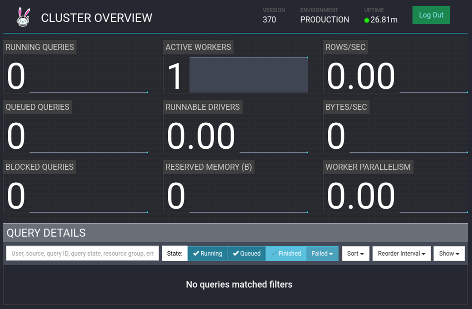

# Walden

Walden is a small data lake meant for solitary use. Read more about it on [our website](https://scie.nz/walden).

## Prerequisites

There are a few things you need before you create your Walden deployment:

- You need a Linux environment from which to run the code. The code was tested against Ubuntu 20.04 LTS as well as Arch Linux.
- You need a Kubernetes Cluster. If you don't know what that is, check out [K3s](https://k3s.io/).
- Your Kubernetes cluster needs to have at least 4 nodes (regular PCs are fine), with at least 6GB of RAM. We run this on 4 machines, each with 16 GB RAM. It works.
- You need to install [Helm](https://helm.sh/docs/intro/quickstart/), a Kubernetes templating engine. We use this to generate secrets and handle some minor templating.

## Running Walden

### Deploy Walden

```
git clone https://github.com/scie-nz/walden
cd walden/kube
./deploy.sh # requires Helm and kubectl access to cluster
```

You should see a whole bunch of text resulting from the deploy command. As
long as no obvious errors show up, that's expected.

To check the health of your cluster run:
```
kubectl get pods -n walden
```

(If you're using k3s locally, preface this command like so:
 `k3s kubectl get pods -n walden`)

A healthy deployment looks like this:
```
NAME                               READY   STATUS    RESTARTS   AGE
devserver-65d668b5c6-s62m7         1/1     Running   0          49s
metastore-8696bf6b46-455qx         1/1     Running   0          49s
superset-worker-69cd7c966-pwsp8    1/1     Running   0          49s
superset-postgres-0                1/1     Running   0          48s
metastore-postgres-0               1/1     Running   0          48s
superset-66fb584c7d-wc8c4          2/2     Running   0          48s
trino-coordinator-8c6bc455-w2qdw   1/1     Running   0          48s
trino-worker-86d9484f75-7j8cw      1/1     Running   0          47s
superset-redis-0                   1/1     Running   0          47s
minio-0                            1/1     Running   0          47s
minio-1                            1/1     Running   0          36s
minio-2                            1/1     Running   0          27s
minio-3                            1/1     Running   0          21s
```

By default, Walden expects your cluster to have at least four machines/nodes.
If you don't have four nodes, you may see MinIO pods that are stuck in `Pending`.
You can get things unstuck by manually editing the `minio` StatefulSet and removing
the `affinity` block, allowing multiple MinIO pods to deploy on the same machine:
```
# Edit MinIO StatefulSet, remove affinity block
$ kubectl edit statefulset -n walden minio
```

If something else has gone wrong, `kubectl logs -n walden [name of pod]` should help
most of the time. If you need to do more debugging because something is failing
but are new to Kubernetes, about now would be a good time to go through
a [tutorial](https://kubernetes.io/docs/tutorials/kubernetes-basics/).

### Use devserver to access Trino CLI

Assuming the deployment succeeded, you can ssh into the pod corresponding to
your devserver like so (make sure to replace `devserver-6c9fcf987c-9vznj`
with your pod ID from `kubectl get pods -n walden`:
```
$ kubectl exec -n walden -it deployment/devserver -- /bin/bash
```

#### Create a test MinIO bucket

Now that you are logged in to the devserver, you are ready to interact with
your glorious data pond! To do so you first need to create a MinIO bucket,
where you will store your data:
```
devserver# mc alias set walden-minio/ http://minio:9000 $MINIO_ACCESS_KEY_ID $MINIO_ACCESS_KEY_SECRET
Added `walden-minio` successfully.

devserver# mc mb walden-minio/test
Bucket created successfully: `walden-minio/test`
```

Note -- `walden-minio` is an alias to the MinIO deployment created
automatically when we start the devserver. We have created a
bucket called "test".

#### Use Trino to create a schema and a table

First, run (from the devserver shell):
```
devserver# trino test
```

This command starts a session of the trino CLI with the "test" schema. This
schema does not actually exist in the metastore yet, so we need to create it:
```
trino:test> CREATE SCHEMA IF NOT EXISTS test WITH (location='s3a://test/');
CREATE SCHEMA
```

If you run `SHOW SCHEMAS` you should see:
```
trino:test> SHOW SCHEMAS;
       Schema
--------------------
 default
 information_schema
 test
(3 rows)
```

Now we can create a table and store some data:
```
trino:test> CREATE TABLE dim_foo(bar BIGINT);
CREATE TABLE

trino:test> INSERT INTO dim_foo VALUES 1, 2, 3, 4;
INSERT: 4 rows
```

Assuming everything is working, you should be able to query the stored values:
```
trino:test> SELECT bar FROM dim_foo;
 bar
-----
   1
   2
   3
   4
(4 rows)

Query 20220208_051155_00006_zfgnn, FINISHED, 1 node
Splits: 2 total, 2 done (100.00%)
0.36 [4 rows, 250B] [11 rows/s, 691B/s]
```

### Explore data with Superset

Superset provides a convienient UI for exploring the data that you've stored in Trino.
Walden includes an instance of Superset that's preconfigured to connect to Trino.

Superset has been configured with a `walden` user and a randomly generated password.

Get the password for logging into Superset:
```
$ kubectl get secret -n walden superset-admin -o 'jsonpath={.data.pass}' | base64 -d && echo
lONGpASSWoRD64HERE
```

Set up a port-forward to access Superset on port `8088`:
```
$ kubectl port-forward -n walden deployment/superset 8088
```

Go to [http://127.0.0.1:8088/](`http://127.0.0.1:8088/`) and log in with user=`walden` and the password you got earlier.

Two Trino databases should have been automatically added to Superset by Walden:
- `walden-trino` has Trino data, including what we added to a `test` schema in earlier steps. The data itself is being stored to Minio in Hive columnar table format, with the Metastore acting as the index.
- `walden-trino-system` has various Trino System statistics like node connectivity that may also be interesting to explore.
In addition to these autoconfigured, you should be able to add other external databases to Superset as well via `Data` > `Databases` in the top menu.

We can start exploring by going to `SQL Lab` > `SQL Editor` in the top menu.
In the SQL Editor view, select the `walden-trino` database, then the `test` schema that we created earlier.
The values we added to this schema earlier should also be visible via Superset.


### View the Trino Dashboard

Trino also provides a dashboard UI showing basic activity. Set up a port-forward to access the dashboard on port `8080`:
```
$ kubectl port-forward -n walden deployment/trino-coordinator 8080
```

Go to [http://127.0.0.1:8080](`http://127.0.0.1:8080`) and log in with any value for the username (it doesn't matter).



## Conclusions

That's it, this is an easy way to get a small data lake working.
This is meant to be a fully functional starting point that can be expanded and customized to fit your needs.
Everything here is provided as-is, so your mileage may vary.
Please report any bugs or issues and we will try to get to them.

## Other Notes/Reference

### Building images using Kaniko

Cheat sheet for building images from within an existing cluster.
This can also be done locally via the Docker CLI or similar.
```
kubectl create secret -n walden docker-registry regcred --docker-server=https://index.docker.io/v1/ --docker-username=[your-docker-username] --docker-password=[your-docker-password]
kubectl apply -f kube-build/templates/kaniko-devserver.yaml
```

After building/pushing new release images, update the default `WALDEN_VERSION` in `kube/deploy.sh`.

### Deploying with custom images

Walden can be deployed with custom images from your registry/organization.

1. Assign registry/org prefix (default `docker.io/scienz`): `export WALDEN_ORG=myregistry.example/myorg`
2. (Optional) Assign tag suffixes (default current `YYYY.mm.dd`):
    - Shared tag across images: `export WALDEN_TAG=1234`
    - Individual image overrides: `export WALDEN_DEVSERVER_TAG=1234 WALDEN_METASTORE_TAG=2345 WALDEN_SUPERSET_TAG=3456 WALDEN_TRINO_TAG=4567`
2. Build and push images: Run `docker/*/build.sh` and `docker/*/push.sh`
3. Deploy environment using the images: Run `kube/deploy.sh`

### Deploying more MinIO nodes

MinIO must be deployed with at least four nodes, which is the default number used by Walden.
If you'd like to deploy more MinIO nodes, specify a custom `MINIO_REPLICAS` value when running `deploy.sh`.

### Deploying MinIO on alternate architectures

The MinIO images are multi-arch and so can be configured to run on nodes with non-`amd64` architectures.
In our case, we have a mixed-architecture cluster where several `arm64` Raspberry Pis provide local storage, making them a convenient place for running the MinIO pods.
To deploy with MinIO nodes on a different architecture, deploy with `MINIO_ARCH=arm64`.
Note that we do not support custom architectures for the `walden-*` images themselves, as the underlying software doesn't deal with it well.


